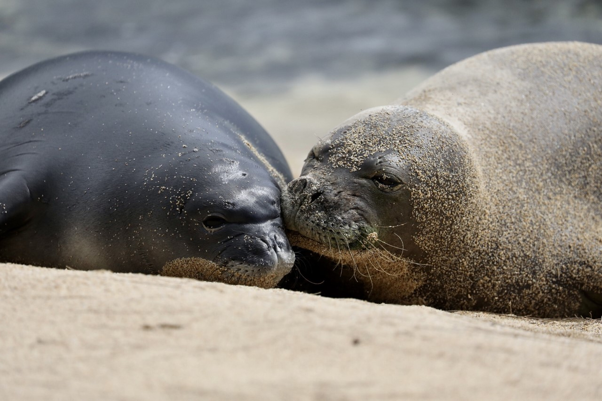
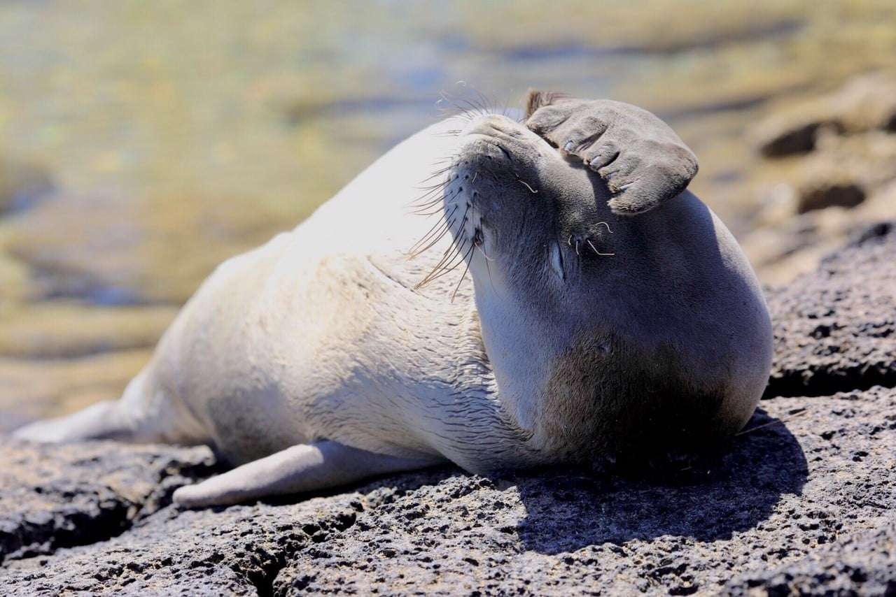
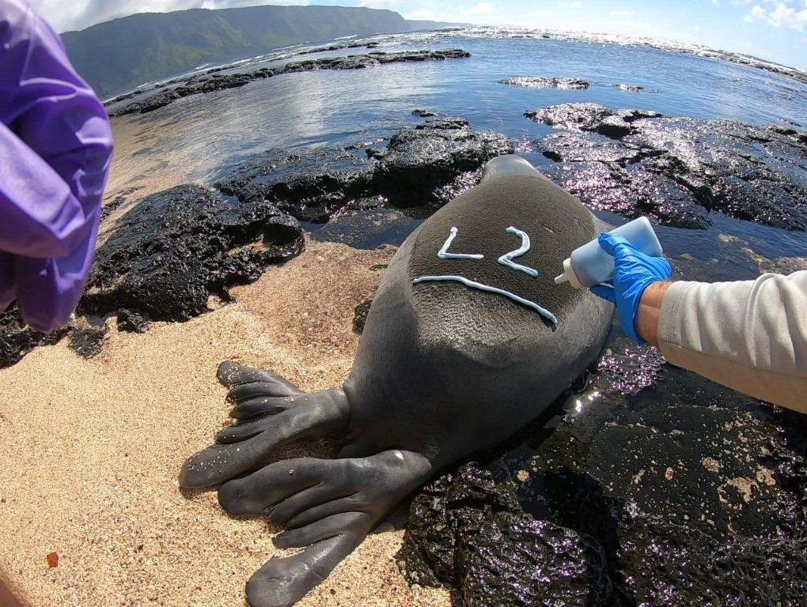

### About This App

*Hawaiian Monk Seals at Kalaupapa National Historical Park* is an app that lets you visualize [Kalaupapa National Historic Park](https://www.nps.gov/kala/index.htm)'s monk seal survey data. From the top navigation panel you'll be able to access a seal genealogy tree, observed seal locations, graphs displaying seal observation data, as well as mother and pup characteristics. Additionally, using the side panel to the left, you can dive into the life history of this special marine species.

### Creators and Data Source

This app was created by Katherine Rosencrance, Annie Combs, and Alessandra Puig-Santana for the course ESM 244 - Advanced Data Analysis at the University of Santa Barbara. Data were obtained from Glauco Puig-Santana, a biological technician working at Kalaupapa National Historical Park. The data are not publicly available, but the original data files contained seal and pup observations dating back to 2021 and genealogy data beginning in 1997. The side panel tab "NPS Surveys" details the data collection methods used for the data included in this app. Enjoy!

### Seal Life Cycle

Monk seals spend two-thirds of their life at sea. They’ll molt completely once a year which helps keep their coat clean and free of algae growth. They can live to over 30 years, though life expectancy is often shorter. They can hold their breath for up to 20 minutes and dive more than 1,800 feet! However, an average dive is much shorter and shallower. Though they don’t migrate, they can travel hundreds of miles throughout the Hawaiian archipelago.

### NPS Surveys

Kalaupapa National Historical Park employees help to conserve the Hawaiian Monk Seal population. Throughout the year, marine biologists that work for the National Park Service walk the beaches to observe, take pictures of, and monitor the behavior of the seals. Biologists observe seal pupping to track reproduction rates and grwoth among new members of the population. To keep track of the seals, the employees look for tags with numbers on their flippers, bleach marks, or identifying scars. Surveys also help conservationists understand seal monk generations and family patterns. Surveys and photos of monk seals are always conducted under a NOAA Fisheries permit and in partnership with NOAA’s Pacific Islands Fisheries Science Center.

**Citation:** National Park Service. (2022, December 22). Hawaiian Monk Seal. https://www.nps.gov/kala/learn/nature/monkseal.htm
